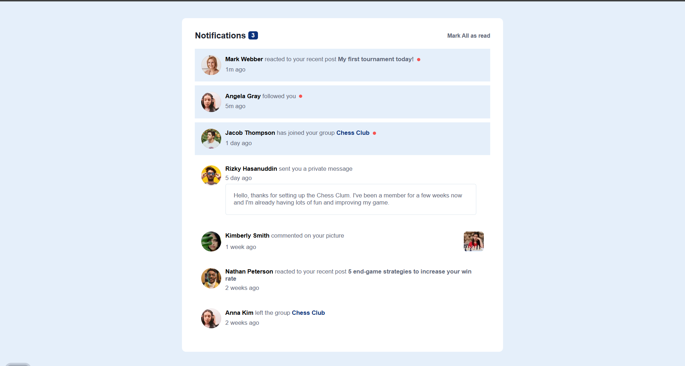

# Frontend Mentor - Notifications page solution

This is a solution to the [Notifications page challenge on Frontend Mentor](https://www.frontendmentor.io/challenges/notifications-page-DqK5QAmKbC). Frontend Mentor challenges help you improve your coding skills by building realistic projects. 

## Table of contents

- [Overview](#overview)
  - [The challenge](#the-challenge)
  - [Screenshot](#screenshot)
  - [Links](#links)
- [My process](#my-process)
  - [Built with](#built-with)
  - [What I learned](#what-i-learned)
  - [Continued development](#continued-development)
  - [Useful resources](#useful-resources)
- [Author](#author)
- [Acknowledgments](#acknowledgments)

**Note: Delete this note and update the table of contents based on what sections you keep.**

## Overview

### The challenge

Users should be able to:

- Distinguish between "unread" and "read" notifications
- Select "Mark all as read" to toggle the visual state of the unread notifications and set the number of unread messages to zero
- View the optimal layout for the interface depending on their device's screen size
- See hover and focus states for all interactive elements on the page

### Screenshot




### Links

- Solution URL: [Add solution URL here](https://github.com/Ramelzkie96/notification-page.git)
- Live Site URL: [Add live site URL here](https://notification-page-ramel.netlify.app/)


### What I learned

Working on this Frontend Mentor project taught me a lot about structuring and styling HTML and CSS in a clean, responsive way. Here are some key takeaways:

1. Structuring Layout with Flex and Grid
I learned how to use Flexbox and CSS Grid to manage layout alignment and spacing effectively:
```css
.hover {
  transition: 0.2s ease-in-out;
  cursor: pointer;
}

.hover:hover {
  color: var(--color-blue) !important;
}
```
 2. Hover Effects for Better UX
I added interactive hover effects to elements using simple CSS transitions:
```css
.hover {
  transition: 0.2s ease-in-out;
  cursor: pointer;
}

.hover:hover {
  color: var(--color-blue) !important;
}

```
3. Notification Styling and Status Dots
I learned how to visually differentiate read vs. unread notifications using background colors and a small red dot:
```css
.notification-box .profile .dot {
  width: 8px;
  height: 8px;
  border-radius: 50%;
  background: var(--color-red);
}

```
